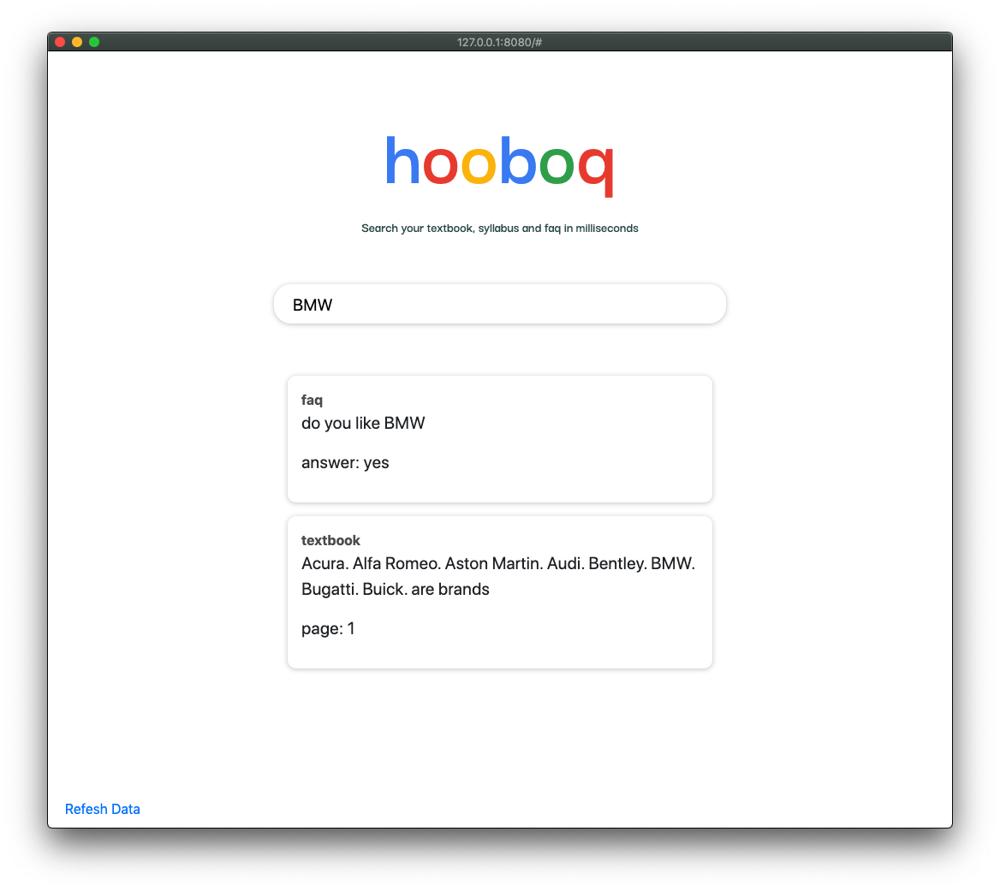

# inclass search engine

A search engine approach to providing student fast and relevant answers to class specific questions.



#### Installation

```bash
cargo install sonic-server
```

```bash
git clone https://github.com/drbh/inclass-search-engine.git
cd inclass-search-engine
```

### Running sonic search indexer


```bash
sonic -c ~/Desktop/inclass-search-engine/config.cfg 
```

### Running server

```bash
go run main.go
```

### Adding a single class

First we'll need to import the data we want to index and serve. We will put this data in the `class-input.json` file.

Next we'll run a small python script that will reformt the data for sonic importing (and we will create unique id's for each item)

```bash
python3 format-data.py
```

#### Flushing

go to `http://localhost:8080/flush` to flush the db and `http://localhost:8080/ingester` to repop based on the data we specified in the step above


## TODO

- Show results in UI
- read JSON file in and repopulate sonic
- read JSON file in and repopulate lookup
- do second search on second index (books)
- do third search on third index (syllabus)